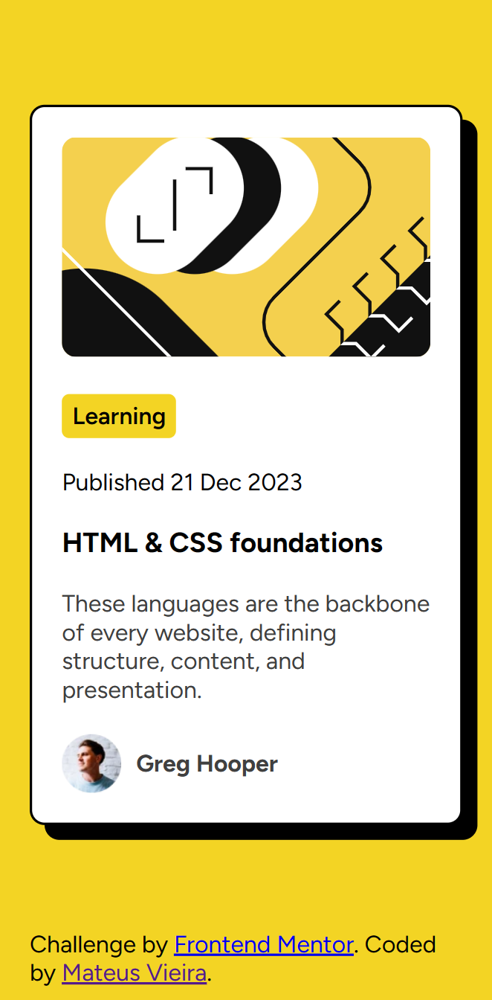

# Frontend Mentor - Blog preview card solution

This is a solution to the [Blog preview card challenge on Frontend Mentor](https://www.frontendmentor.io/challenges/blog-preview-card-ckPaj01IcS). Frontend Mentor challenges help you improve your coding skills by building realistic projects. 

## Table of contents

- [Overview](#overview)
  - [The challenge](#the-challenge)
  - [Screenshot](#screenshot)
  - [Links](#links)
- [My process](#my-process)
  - [Built with](#built-with)
  - [What I learned](#what-i-learned)
  - [Continued development](#continued-development)
  - [Useful resources](#useful-resources)
- [Author](#author)
- [Acknowledgments](#acknowledgments)

**Note: Delete this note and update the table of contents based on what sections you keep.**

## Overview

### The challenge

Users should be able to:

- See hover and focus states for all interactive elements on the page

### Screenshot
#### Desktop

#### Mobile

### Links

- Solution URL: [Front-end blog preview](https://github.com/matmv21/front-end-blog-preview.git)
- Live Site URL: [matmv21.github.io](https://matmv21.github.io/front-end-blog-preview)

## My process

### Built with

- Semantic HTML5 markup
- CSS custom properties
- Flex
- CSS Grid

### What I learned

I learned more about the properties of CSS and how to make divs centralize.

### Continued development

This project may receive more features in the future.

## Author

- Website - [Mateus Vieira](https://matmv21.github.io)
- Frontend Mentor - [@matmv21](https://www.frontendmentor.io/profile/matmv21)
- Linkedin - [Linkedin profile](https://www.linkedin.com/in/mateus-vieira-835b111b2/)